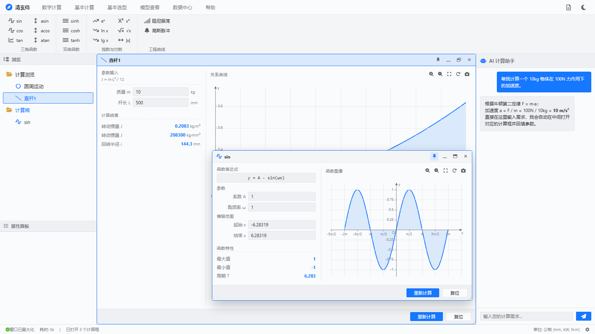
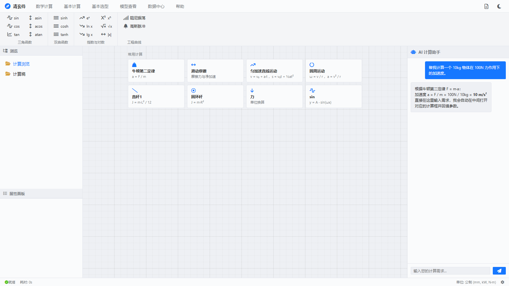
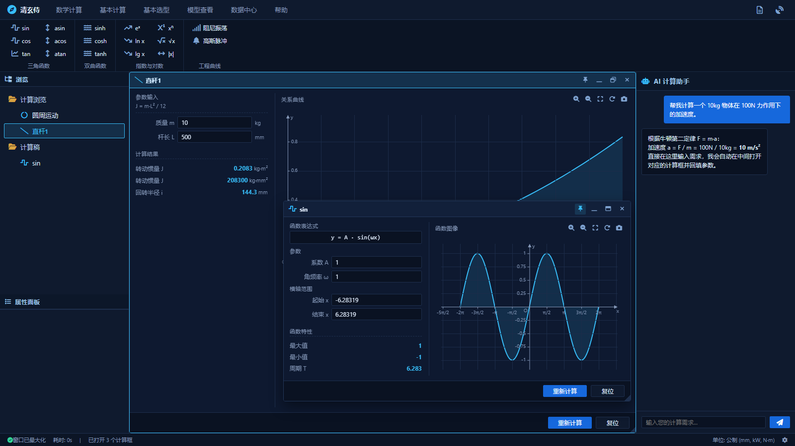
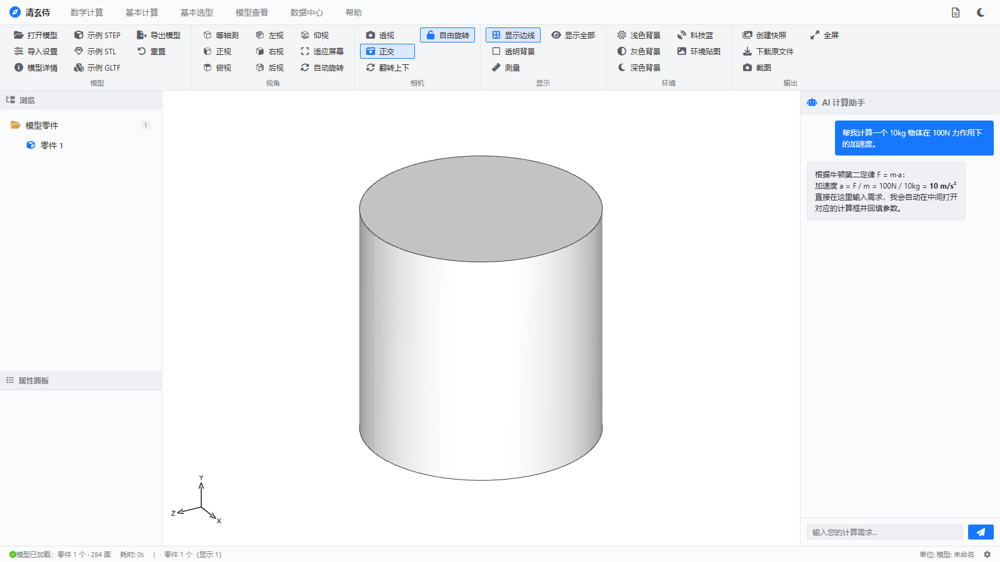
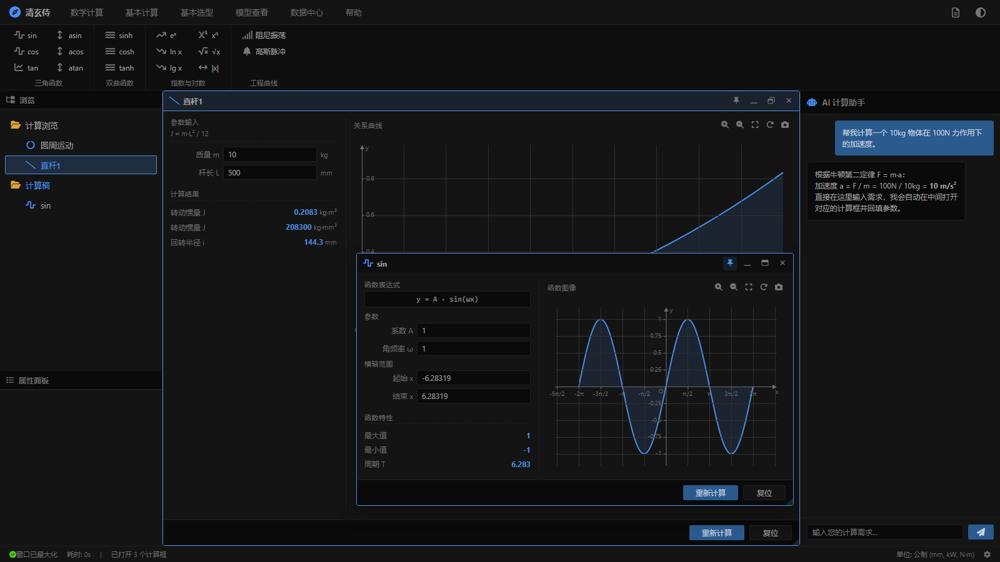

# 清玄侍

> 桌面式工程计算工作台：顶部菜单 + 功能区（Ribbon）+ 左中右三栏 + 状态栏，
> 浮动计算框、关系曲线、3D 模型查看与 AI 助手都在一个页面里完成。
> **纯前端、无登录、无后端依赖**，`npm run dev` 打开即用。



| 首页（空状态） | 科技蓝主题 | 3D 模型查看 |
|---|---|---|
|  |  |  |

---

## 一、功能特性

**计算工作台**

- **功能区（Ribbon）** 6 个一级菜单：数学计算 / 基本计算 / 基本选型 / 模型查看 / 数据中心 / 帮助；
  按钮可**拖进左侧浏览树**变成标签，也可以直接点击在中间开一个计算框。
- **浮动计算框**：可拖动、8 方向缩放、最小化 / 最大化 / 固定在最上层、关闭；
  位置尺寸会被记住，同一个标签再次打开时沿用。
- **浏览树**：文件夹（计算浏览 / 计算稿）里放标签，最多 **15 个/文件夹**；
  支持就地改名、右键菜单、拖动排序与跨文件夹移动、复制成独立参数的副本。
- **关系曲线**：公式计算框右侧实时绘制曲线，支持放大 / 缩小 / 重置视图 / 截图；
  鼠标靠近曲线会吸附并显示读数，自动识别**极大值 / 极小值 / 与坐标轴交点**。
- **计算记录**：中栏空状态显示「常用计算」8 张常用卡片 + 最近**三次**计算记录，点一下即可还原标签与参数。

**3D 模型查看**

- 内嵌 [Online3DViewer](https://github.com/kovacsv/Online3DViewer) 引擎，支持 **step / iges / brep / stl / obj(+mtl) / 3ds / gltf·glb / fbx / dae / 3mf / amf / ifc / ply / off / wrl / 3dm / fcstd / bim** 等格式。
- 视角（等轴测 / 正视 / 后视 / 左视 / 右视 / 俯视 / 仰视，图标是"轴测立方体 + 看哪一面就把哪一面涂黑"）、相机（透视 / 正交 / 翻转上下 / 自由旋转切换）、显示（边线 / 透明背景 / 测量）、环境（背景色 / 环境贴图）、输出（快照 / 下载原文件 / 截图 / 全屏）全部做成功能区按钮。
- 模型详情、导入设置是**两个独立的可拖动浮层**，只在中栏内活动，外观与计算框一致。

**三套主题**：白 / 黑 / 科技蓝，一键循环切换，刷新后保持。

**AI 计算助手**：右栏对话，默认走**离线解析**（识别关键词与数值单位，自动开框并回填参数），也可切到后端接口。

---

## 二、技术栈

| 项 | 版本 |
| --- | --- |
| Vue | 3.5 |
| Vite | 7 |
| Pinia | 3 |
| Vue Router | 4 |
| Chart.js | 4（关系曲线 / 函数图像） |
| axios | 1.x（沿用 RuoYi 风格的请求封装） |
| Font Awesome | 6（全部图标） |
| 3D | Online3DViewer + OCCT wasm 导入器 + three.js |

**不依赖 Element Plus**：消息提示、确认框、加载遮罩都是原生 DOM + CSS 变量实现（`src/plugins/modal.js`）。

---

## 三、快速开始

**环境要求**：Node.js `^20.19.0 || >=22.12.0`（Vite 7 的要求）。

```bash
git clone https://github.com/warmasy/hokkk.git
cd hokkk
npm install

npm run dev      # 开发服务器：http://localhost:81
npm run build    # 构建到 dist/
npm run preview  # 预览构建产物
```

- 开发端口固定 **81**（`vite.config.js`），避免与本机其它项目冲突。
- 需要后端时改 `.env.development` 的 `VITE_APP_PROXY_TARGET`（默认 `http://localhost:8080`），
  请求前缀 `/dev-api`；生产环境改 `.env.production` 的 `VITE_APP_BASE_API`。
- `public/o3dv` 与 `public/o3dv-site` 是 3D 引擎的静态资源（约 31MB），**不要删**，否则「模型查看」打不开。

### 部署（Netlify / 阿里云 ESA Pages）

仓库里已经带了两个平台的开箱配置，都是"纯静态 SPA"：构建产物在 `dist/`，路由交给 Vue Router。

| 平台 | 配置文件 | 关键内容 |
| --- | --- | --- |
| **Netlify** | [`netlify.toml`](netlify.toml) | `command = npm run build`、`publish = dist`、`NODE_VERSION = 22`、SPA 回退（`/* → /index.html 200`）、哈希产物强缓存 / `o3dv` 缓存一周 / `index.html` 不缓存、基础安全响应头 |
| **阿里云 ESA（函数和 Pages）** | [`esa.jsonc`](esa.jsonc) | `buildCommand`、`assets.directory = ./dist`、`notFoundStrategy = singlePageApplication`（未命中的导航请求回退 `index.html` 并返回 200） |

- **Node 版本**：两层都会读 `package.json` 的 `engines.node`（本仓库是 `>=22.12.0`，Vite 7 的要求）；ESA 以 `engines.node` 为准，Netlify 另外用 `NODE_VERSION = "22"` 固定大版本。
- **ESA 的 `name`** 指目标 Pages 项目名（不存在会自动创建）：现在是 `hokkk`，想换成别的项目名就改这一行。
- **环境变量**：两张平台都在各自控制台配置（ESA 的构建环境变量不在 `esa.jsonc` 里；本项目生产环境无需额外变量，`npm run build` 默认就是 production 模式）。
- **部署到子路径**：如果站点不是挂在域名根目录，需要同时改 `vite.config.js` 的 `base` 和 `.env.production` 的 `VITE_APP_ROUTER_BASE`。

---

## 四、界面结构

| 区域 | 内容 |
| --- | --- |
| 顶栏 | 品牌名、一级菜单、文档入口、主题切换 |
| 功能区 | 当前菜单对应的一整套按钮，按 **列优先**（每列 3 个）排布，超出后收进「更多」 |
| 左栏 | 「浏览」树（文件夹 + 标签）+「属性面板」（按要求保持为空，只留标题） |
| 中栏 | 计算框容器；没有计算框时显示工程图纸网格 + 常用计算卡片；「模型查看」菜单下是 3D 画布 |
| 右栏 | AI 计算助手（对话 + 自动开框回填） |
| 状态栏 | 状态文字、耗时、已打开计算框数量、单位信息 |

---

## 五、快捷键与鼠标操作

**键盘**

| 按键 | 作用 |
| --- | --- |
| `Esc` | 关闭右键菜单 / 取消树节点改名 / 关闭「标签数量已达上限」弹窗 / 收起功能区「更多」菜单 |
| `Enter` | 树节点改名确认；AI 输入框发送消息 |
| `Ctrl`（或 `⌘`）+ 点击 | 在「模型零件」列表里**多选 / 取消多选**零件 |

**鼠标（工作台）**

| 操作 | 效果 |
| --- | --- |
| 点击功能区按钮 | 在中间打开对应的计算框，并在当前文件夹生成一个标签 |
| 按住按钮拖到文件夹 | 把该功能放进指定文件夹（拖到节点上/下半区可插入到指定位置） |
| 单击树节点 | 打开对应计算框；已打开则前置并高亮 |
| 双击树节点 | 就地改名（`Enter` 确认 / `Esc` 取消） |
| 右键树节点 | 重命名 / 复制节点（独立参数副本）/ 打开计算框 / 删除 |
| 右键文件夹 | 折叠·展开 / 关闭所有标签 / 删除所有标签 |
| 点击文件夹**图标** | 折叠 / 展开（默认全部展开） |
| 点击文件夹**名字** | 把该文件夹设为新标签的默认落点 |
| 按住树节点拖动 | 调整顺序，或拖到别的文件夹完成移动 |
| 拖计算框标题栏 | 移动窗口（往下可以拖出显示区，会保留 40px 标题栏；上/左/右不会拖出中栏） |
| 拖计算框四边/四角 | 8 方向缩放（最小 340×220） |
| 鼠标在曲线上移动 | 8px 内吸附曲线并显示读数；靠近关键点 12px 内弹出说明框 |

**鼠标（3D 视图）**

| 操作 | 效果 |
| --- | --- |
| 左键拖动 | 旋转 |
| `Shift` + 左键拖动 | 平移 |
| `Ctrl` + 左键拖动 | 缩放 |
| 中键 / 右键拖动 | 平移 |
| 滚轮 | 缩放 |

---

## 六、交互细节

> 这一节记录的是逐项确认过的交互行为，改动前请先对照。

| 操作 | 效果 |
| --- | --- |
| 点击功能区任意功能 | **自动把该功能加入「浏览」树的当前文件夹**（生成一个标签），同时在中间弹出它的计算框 |
| 重复点击同一功能 | 树上再加一个节点（同名自动编号 2、3…），中间**再开一个新框**，各框参数完全独立 |
| 公式计算框 | 左栏「参数输入 + 计算结果」，右栏「关系曲线」；打开时按内容自动适配尺寸 |
| 单位换算框 | 设置区压成**一行**（数值 + 源单位 + 交换按钮 + 目标单位），下面一条 28px 高的主结果行，再下面是**单列换算表**——**第一行固定是原单位、第二行固定是目标单位**（这两行用蓝色高亮底色标出），其余按单位表顺序；单位只显示**英文简写**（N、kN·m、kgf/cm²…），鼠标悬停显示中文全称 |
| 函数绘图框 | 左栏「函数表达式 / 参数 / 横轴范围 / 函数特性」，右栏「函数图像」；改任一参数或横轴范围，图像**实时重绘** |
| 画布工具条 | 仅在**当前激活的计算框带关系曲线**时出现 |
| 中栏空状态 | 没有任何计算框时，中栏**靠上居中**显示：工程图纸网格底纹（20px 副格 + 100px 主格，颜色随主题）+「常用计算」8 张卡片（牛顿第二定律 / 滑动摩擦 / 匀加速 / 圆周运动 / 直杆惯量 / 圆环惯量 / 力换算 / sin）+ 下面「计算记录（最近三次）」，点记录卡片即可调出当时的标签与参数 |
| 计算框打开 | **按所在文件夹决定默认形态**：`计算浏览`（复杂计算）打开即**最大化**铺满中栏；`计算稿`（辅助/实时计算）打开是**内容自适应的小窗口**。两种情况都从被点击的按钮 / 卡片 / 树节点位置放大出现（190ms）；手动改过尺寸后按你的设置记着（下次打开沿用） |
| 固定在最上层 | 标题栏的**图钉按钮**：固定后该窗口永远显示在其它计算框之上，仍可拖动/缩放/改参数。`计算稿` 里的标签**打开时默认就是固定的**，`计算浏览` 里默认不固定；**把标签在文件夹之间拖动时会按目标文件夹的默认形态自动切换**：拖到 `计算浏览` → 取消固定**并自动最大化**；拖到 `计算稿` → 还原成小窗口**并自动固定**（状态栏有提示）；这些状态会记进"上次位置"，手动点图钉切换过的状态同样被记住 |
| 控件尺寸 | 全站统一用 `--field-h: 24px` / `--field-radius: 2px` / `--field-font: 12px`，新增控件请沿用这三个变量 |
| 计算框标题栏按钮 | `📌` 固定在最上层（再点取消）；`—` 最小化（窗口收起、标签保留在树里）；`□` 最大化/还原；`×` 关闭（窗口与左侧标签一起删除，底部「关闭」同效） |
| 拖动计算框标题栏 | 左/上/右不会拖出中栏，但**往下可以拖出显示区**（只留 40px 标题栏供继续操作）；**没有吸附**；3px 阈值、指针捕获、全程 `cursor:move` 且不选中文字；拖动中只更新临时位置，松手才提交；**最大化时直接拖标题栏会先还原成小窗口再跟着鼠标走**；位置**每帧只落一次** |
| 调整计算框大小 | **四边 + 四角共 8 个把手**，光标随方向变化（`ns/ew/nwse/nesw-resize`），最小 340×220，放大不会越过中栏边界；拖动中尺寸每帧落位一次，图表重绘限制在 ~150ms 一次 |
| 窗口 ↔ 目录树双向高亮 | 点左侧目录树的标签 → 对应窗口前置并**闪一下边框**（标题栏也高亮）；点/操作某个窗口 → 左侧目录树里对应的标签同步高亮 |
| 框内按钮 | 「重新计算」按当前参数重算；「复位」把参数、横轴范围（单位换算还含源/目标单位与数值）**恢复成默认值**；「关闭」同标题栏 × |
| 拖动功能区按钮 → 指定文件夹 | 按住按钮拖出去（拖动中出现跟随光标的标签、落点高亮）：放到文件夹=追加，放到节点上/下半区=插入到该位置 |
| 点击可靠性 | 功能区按钮与树节点都**不用 HTML5 draggable**，改用指针事件 + 6px 阈值判定：手抖几个像素不会触发拖拽，**点击永远有效** |
| 标签数量上限 | 每个文件夹最多 **15 个标签**。要开第 16 个时弹出「标签数量已达上限」对话框：**可多选**要删掉的标签（两列排布，支持全选/取消全选），确认后先删除所选（连同它们的计算框），再自动继续被拦下的添加/复制/移动/拖入操作；点「取消」放弃这次添加。**弹窗不拦截鼠标**（`pointer-events:none` + `z-index:12000`）：弹窗打开时左侧树照样能操作、计算框也照常开；在树里删掉的标签会**同步从弹窗列表消失**，腾出位置后主按钮变成「继续添加」，不勾选也能直接继续。**勾选某个标签时它的计算框会自动提到最前**（弹窗始终在最上层，所以窗口排在弹窗下面；该标签还没开窗会先打开作为预览）；点「取消」会把"只为预览打开"的窗口全部关掉。**弹窗与左侧目录树双向同步**（共用 `tagLimit.selectedNodeIds` 一份数据）：弹窗里勾选的标签，树里同步高亮 + 打勾；在树里点标签也会勾上弹窗对应的复选框，再点一次两边一起取消 |
| 计算框内的图表工具条 | 放大 / 缩小 / 重置视图 / 截图，放在**曲线区标题行右侧**（不在图内，不遮挡曲线），无曲线时不显示（原来的「适应屏幕」与「重置视图」行为完全等价，已删除前者） |
| 鼠标在图上移动 | 轻微**吸附到曲线**（8px 内），画出辅助虚线，交点处打一个**橙色环形标记**；移出图外自动消失 |
| 关键点 | 自动识别**极大值点 / 极小值点 / 与 x 轴交点 / 与 y 轴交点**（极值用三分法精修到 1e-6，所以显示的是 π/2 这类精确值）；**平时不显示标记**，只有鼠标靠近 12px 内才吸附，并在点的正上方弹出居中的说明框（带指引线），例如 `极大值点 (-3π/2, 1.6)` |
| 窗口最大化 / 拉伸 | 画布尺寸变化后自动重算关键点像素位置，吸附依然有效 |
| 参数异常时 | 图表区**不会消失**：没有可绘制的点（例如高斯 σ=0、横轴起止相同）时图内给出提示；纵轴范围过大时在上方给出"曲线会被压平"的提醒 |
| 数值显示 | 输入框最多 6 位有效数字（`2π` 显示为 6.28319）；读数与结果把 1e-7 量级的浮点残差显示为 0；只有真正的极大/极小值才用科学计数法 |
| 坐标读数 | 显示在曲线区标题行（图外，不遮挡图像）；π 轴模式下 x 也用 π 表示 |

> 「属性面板」按要求保持为空（只保留标题栏），所有输入与结果都在中间的计算框里。

---

## 七、主题

只保留三种：**白（亮色）/ 黑（暗色）/ 科技蓝**。

| 白（默认） | 黑 | 科技蓝 |
|---|---|---|
|  |  |  |

- 切换：顶栏右上角图标循环切换（顺序见 `src/store/modules/theme.js` 的 `THEME_SEQUENCE = ['light','dark','tech']`）。
- 记忆：写入 `localStorage`（键 `mc-theme`），刷新后保持。
- 切主题时**只关 CSS 过渡、不关动画**：`body.no-transition` 只声明 `transition: none`。
  如果给它加上 `animation: none`，220ms 后类一移除，元素上的入场动画（`mc-window-in` / `mc-guide-in`）会从 0 重播一遍，
  看起来就像"计算框自己刷新了一次"。
- 科技蓝（`.tech-theme`）取自数据大屏风格，但刻意**克制用色**：深蓝底 + 极淡网格底纹，
  青色 `#38bdf8` 只出现在激活按钮、结果数值和曲线上，**全站没有发光/阴影特效**。

新增主题：在 `src/assets/styles/theme.css` 里加一组 CSS 变量（`.xxx-theme { … }`），再登记到 `THEME_SEQUENCE` / `THEME_META`。

---

## 八、数据与持久化

**刷新页面 = 干净的新页面**：左侧浏览树、计算框、参数全部从空白开始，不做工作区恢复
（默认也不放任何预设标签，`INITIAL_NODES` 是空数组）。想预置标签就往
`src/config/tree.js` 的 `INITIAL_NODES` 里加 `{ folderKey, itemKey, label }`。

唯一跨刷新保留的是 **最近三次「计算记录」**（`localStorage` 键 `mc-calc-history`）：

| 项 | 说明 |
| --- | --- |
| 记什么 | 当时打开的计算框（标签名 + 所属文件夹 + 功能）与它们的**全部参数**（公式参数、单位换算的数值/源单位/目标单位） |
| 什么时候记 | 状态变化后防抖 1.5s，页面隐藏 / 离开时立即。与最新一条**是同一批计算**（标签集合、所属文件夹、名称都一样）时只**原地刷新参数**；**换了一批计算**就**新增一条记录**；内容完全没变则不写 |
| 怎么用 | 中栏空状态「常用计算」下方的「计算记录（最近三次）」，点卡片即按原来的文件夹/功能重建标签、还原参数并打开计算框；旁边有「清空」 |

想彻底清空：控制台执行 `localStorage.removeItem('mc-calc-history')`，或调用 `useWorkbenchStore().clearHistory()`。
模型查看界面不受影响：它的资源与设置由 O3DV 自己管理，刷新后在进入该菜单时按需重新加载。

---

## 九、模型查看（3D）

中栏是内嵌的 **3dviewer.net（Online3DViewer）开源引擎**，界面由本项目的布局承载，功能区按钮驱动。

```
public/o3dv/                   引擎 + OCCT 导入器（STEP / IGES / BREP，wasm）
public/o3dv-site/              O3DV 网站包（画布、导入流程、材质、环境贴图）
public/初始模型.STEP            默认模型（打开即加载）
src/views/model-viewer/        ★ 查看器实现（加载、中文化、边线、导航器、材质配色、坐标轴指示）
src/components/ModelViewer.vue 中栏挂载 + 状态同步（零件/统计 -> 左侧树与状态栏）
src/viewer/                    功能区命令层（与查看器实现解耦，新增功能只动这里）
  modelController.js           引擎能力封装：加载 / 相机视角 / 投影 / 背景 / 零件 / 截图
  commands.js                  命令表：功能区按钮 -> 动作
  o3dvControls.js              O3DV 自带控件定位（官方未开放 API 的能力兜底，按中文文案/alt 定位）
  o3dvPanels.js                O3DV 面板的独立浮层（模型详情 / 导入设置 各自一个框，可拖动）
  o3dvDialogs.js               O3DV 弹窗的位置与拖动（默认中栏左上角、夹在中栏内）
src/config/ribbon/modelView.js 功能区按钮（菜单「模型查看」，6 组 34 个按钮）
```

### 支持的格式

`3dm · 3ds · 3mf · amf · bim · brep · dae · fbx · fcstd · gltf/glb · ifc · iges · step/stp · stl · obj(+mtl) · off · ply · wrl`

其中 **STEP / IGES / BREP** 走 OCCT（wasm）解析，其余走引擎自带的解析器。

### 功能区按钮（6 组 33 个）

| 组 | 按钮 |
| --- | --- |
| 模型 | 打开模型 · 导入设置 · 模型详情 / 示例 STEP · 示例 STL · 示例 GLTF / 导出模型 · 重置 |
| 视角 | 等轴测 · 正视 · 俯视 / 左视 · 右视 · 后视 / 仰视 · 适应屏幕 · 自动旋转（前 7 个的图标都是**轴测立方体 + 看哪一面就把哪一面涂黑**，见 `src/components/ViewCubeIcon.vue`） |
| 相机 | 透视 · 正交 / 翻转上下 · 自由旋转（可来回切换：默认**锁定上方向 = 正常转动**，点亮「自由旋转」后斜着拖会带滚转，再点一次恢复） |
| 显示 | 显示边线 · 透明背景 / 测量 · 显示全部 |
| 环境 | 浅色背景 · 灰色背景 · 深色背景 / 科技蓝 · 环境贴图 |
| 输出 | 创建快照 · 下载原文件 / 截图 · 全屏 |

按钮数组顺序 = **按列优先**（功能区是 `flex-direction: column` + wrap，每列 3 个）：
数组前 3 个是第 1 列，接着 3 个是第 2 列，依此类推。

其中**重置**= 恢复默认设置（背景 / 环境贴图 / 显示项 / 导入参数）+ 重新加载默认模型（`/初始模型.STEP`），
视角与材质颜色由"模型加载完成"回调统一复位。

### 视角与坐标约定（改动前先对齐）

模型视图统一按 **Y 轴向上、+Z 为正前方、+X 向右** 的约定（与模型加载时的默认等轴测视角、
SolidWorks 风格默认视角一致）。六个正投影视角都按这套给出「相机方位 `dir` + 画面上方向 `up`」，
定义在 `src/viewer/modelController.js` 的 `VIEW_PRESETS`：

| 按钮 | 相机方位 dir（相对模型中心） | 画面上方向 up | 看到的平面 |
| --- | --- | --- | --- |
| 正视 | +Z | +Y | XY 平面（正前方） |
| 后视 | −Z | +Y | XY 平面（背面，左右镜像） |
| 左视 | −X | +Y | ZY 平面（正前方 +Z 在画面右侧） |
| 右视 | +X | +Y | ZY 平面（正前方 +Z 在画面左侧） |
| 俯视 | +Y | −Z | XZ 平面（正前方 +Z 朝画面下方） |
| 仰视 | −Y | +Z | XZ 平面（正前方 +Z 朝画面上方） |

点这七个按钮时都走 O3DV 自带的 `viewer.navigation.MoveCamera(camera, steps)` **平滑过渡**（约 0.7–0.9s，
和「适应屏幕」「默认视角」同一套动画机制），能看清模型是从哪个方向转过去的；动画结束后相机方向/上方向
精确等于上表的值（`src/viewer/modelController.js` 的 `_moveCameraTo()`）。

左下角的坐标轴指示器（`src/views/model-viewer/composables/useAxisIndicator.js`）每帧用相机的视图矩阵投影世界 X / Y / Z 三轴，
并且**按刚体坐标架绘制**：直接用正交投影后的分量（不做单轴归一化），只把「最长的那根轴」统一缩放到固定像素长度，
所以三根轴的相对长度与夹角就是真实的投影结果，不会随视角乱跳（`等轴测` 下 +X 被压缩得最短，正是因为它最偏向视线方向）。
**朝向观察者或与视线垂直的轴画实线，背向观察者的轴画半透明虚线**；某根轴与视线几乎平行时（正对 / 背对镜头）
退化为一个小圆点 + 字母，不会整条线消失。

### 按钮选中态（功能区高亮）规则

- **开关类 / 面板类**按钮的 `state` 字段声明真实状态来源，高亮 = 当前真实状态：
  模型详情 / 导入设置（浮层是否打开）、显示边线（`edgeSettings.showEdges`）、
  透视·正交（`viewer.GetProjectionMode()`）、锁定·自由旋转（`upVector.isFixed`）、
  测量（`measureTool.IsActive()`）、自动旋转（内部状态）。
- **一次性动作**（视角预设、适应屏幕、重置、截图、快照、导出、下载、打开模型、背景色、环境贴图…）
  只做 420ms 的"按下"高亮，**不会一直亮着**。
- 状态刷新时机：命令执行完、面板浮层开关后立即刷新（自定义事件 `mc:viewer-state-changed`），
  另有 700ms 轮询兜底（引擎内部引起的变化，例如测量结束）。

### O3DV 自带界面的功能去向

| 原位置 | 功能区按钮 | 实现方式 |
| --- | --- | --- |
| 顶栏「详情」面板 | 模型详情 | `o3dvPanels.js` 浮层 + `panelSet.ShowPanel`（顶点/三角面/单位/尺寸/体积） |
| 顶栏「设置」面板 | 导入设置 | 同上（模型显示项、背景色、实体颜色、棱线） |
| 顶栏「导出 / 下载 / 创建快照」 | 导出模型 / 下载原文件 / 创建快照 | 触发 O3DV 官方对话框（多格式导出、原始文件下载、快照可选尺寸） |
| 顶栏「翻转 / 自由旋转」 | 翻转上下 / 自由旋转 | 切换相机向上向量与旋转模式 |
| 顶栏「从 URL 打开 / 分享 / 深色·浅色模式」 | —（不做按钮） | URL 打开与分享只对"按 URL 加载的模型"有效，本项目是本地文件；主题由本项目统一管理 |

**约定**：O3DV 自带的顶栏 / 左侧导航 / 右侧设置栏在 CSS 中隐藏，功能由本项目的功能区与左右面板承担；
需要用到它的面板时，用「模型详情」「导入设置」把它们各打开成**独立浮层**（互不干扰、可同时打开，
关闭时按原样搬回 `.ov_panel_set_content`），见 `src/viewer/o3dvPanels.js`。

### 弹窗与浮层规范

- **位置**：默认停在**模型展示区（中栏）左上角**（内缩 12px），多个浮层同时打开会自动错开 24px；
- **拖动**：按住标题栏即可拖动，**可以一直拖到中栏的最边上**（不做内缩），只保证不超出中栏；
- **样式**：外观与计算弹窗（`.calc-window`）完全对齐 —— 标题栏 32px（图标 + 标题 + 22×22 窗口按钮）、
  正文内边距 10/12、底栏 41px（主按钮 `--accent-fill`、次按钮描边）、数据行「标签左 / 数值右」
  （数值用主题色加粗、等宽数字），与计算弹窗的结果行同款。
  注意 `.o3dv-root` 内是 content-box，所以浮层骨架单独声明了 `box-sizing: border-box`，尺寸才能对上。

### 按需加载与状态保持

- 查看器只在**第一次进入「模型查看」**时挂载（`CenterCanvas.vue` 里 `v-if` + `v-show` 组合），
  刷新页面停在别的菜单时不会加载 3D 引擎与模型；
- 之后切菜单用 `v-show` 保留实例（模型、视角、设置不丢）；中栏重新可见时由 `ModelViewer.vue`
  里的 ResizeObserver 补一次布局重算与浮层摆位（隐藏期间画布尺寸是 0，引擎算不出来）。

### 3D 模块的踩坑记录（改动前务必看）

1. **绝不要给 `.main_left_container / .main_right_container` 任何可见宽度**（包括 CSS `width`、`display:block`）。
   O3DV 的 `layouter.Resize()` 用 `画布宽 = main 宽 - 左容器宽 - 右容器宽` 计算，容器一有宽度画布就变窄，
   而且**不会自动恢复**（表现为"界面有时候会变小"，只有改变窗口尺寸才复原）。
2. **绝不要调用 `viewer.Resize()`（不带参数）**，必须走 `layouter.Resize()`。
   `viewer.Resize(width, height)` 内部会做 `width - margin`：不传参数就是 `undefined - 数字 = NaN`
   → three.js `setSize(NaN, NaN)` → `canvas.width` 被置为 **0** → 画布位图 0×0、画面全空。
   表现是"模型加载出来一闪就消失"，而画布的 CSS 尺寸看起来还是正常的。
3. **初始视角的适配距离要用引擎自己的算法**：`viewer.navigation.GetFitToSphereCamera(center, radius)`
   （与「适应屏幕」按钮同一套），手写的半角正弦公式只做兜底。因为 `model_loaded` 事件发出时网格可能还没进场景，
   `GetBoundingSphere()` 拿到的是上一个模型/空包围球。`index.vue` 的 `applyDefaultViewWhenReady()` 会
   **重试（最多 2.5s）** 等画布位图尺寸 > 0 且包围球有效，适配成功后再复核一次半径是否变化。
4. **同一时间只能加载一个模型**：引擎加载中再发一次 `LoadModelFromUrlList` 会被直接丢掉。
   所以「打开模型 / 示例 / 重置」都走 `whenViewerReady()` 排队（等就绪且空闲再发），
   并且用户自己加载过模型后（`modelViewer.hasManualLoad()`），启动时的默认模型不再覆盖他的选择。
5. **相机适配距离不能按可能为 0 的画布尺寸算**：`半径 / sin(半角)` 在画布宽高为 0 时会得到 0 → 距离 = ∞ →
   模型飞出视野。`useModelDisplay.js` 的 `getFitDistance()` 已做兜底（位图尺寸无效时回退 CSS 尺寸；算不出有限正数就不动相机）。
6. `ModelViewer.vue` 里有 800ms 的**自愈**轮询：画布没铺满中栏、画布位图被清零、相机距离非有限时自动重算布局 /
   回到默认视角（连续纠正 10 次后停手，恢复正常即归零）。
7. 主题联动只保留一处（`ModelViewer.vue`，跟随本项目的白/黑/科技蓝）。原 `useO3dvViewer.js` 里监听
   `html.dark` 的"系统主题同步"已废弃：本项目主题类写在 body 上，html 上永远没有 dark，它会在深色主题下把 O3DV 强切回亮色。

**新增一个 3D 功能**：在 `src/viewer/commands.js` 加一条命令 → 在 `src/config/ribbon/modelView.js`
加一个按钮即可，界面与布局都不用改。若该功能只在 O3DV 自己界面里，则在
`src/viewer/o3dvControls.js` 登记一条文案即可按文案触发。

---

## 十、目录结构

```
hokkk
├─ index.html                 入口 HTML
├─ vite.config.js             别名 @ -> src、端口 81、接口代理、watch 忽略规则
├─ .env.development           开发环境变量（接口前缀 / 代理目标 / AI 开关）
├─ .env.production            生产环境变量
├─ docs/images/               README 截图
├─ public/
│  ├─ favicon.svg
│  ├─ 初始模型.STEP            默认 3D 模型
│  ├─ o3dv/                   O3DV 引擎 + OCCT wasm
│  └─ o3dv-site/              O3DV 网站包与示例模型
└─ src
   ├─ main.js                 应用入口（注册 pinia/router、引入全局样式）
   ├─ App.vue                 根组件（仅路由出口）
   ├─ api/                    接口层（所有 HTTP 请求都放这里）
   │  ├─ index.js             统一出口：import { executeCalc } from '@/api'
   │  ├─ calc.js              计算执行 executeCalc + 方案增删改查 / 导出
   │  └─ ai.js                AI 对话接口（未配置时自动走本地解析）
   ├─ calc/                   ★ 计算内核（纯 JS，与界面、请求完全解耦）
   │  ├─ index.js             注册表：本地公式 / 数学函数的统一入口
   │  ├─ plot.js              采样与曲线数据：buildSeries / buildFunctionPoints / functionStats
   │  ├─ inertia.js           惯量公式（直杆、圆弧、矩形、椭圆、圆环、复合、U 型）
   │  ├─ mechanics.js         力学公式（牛顿第二定律、动量、碰撞、摩擦、功）
   │  ├─ kinematics.js        运动学公式（匀速、匀加速、圆周、变加速、角运动、求解）
   │  └─ math.js              数学函数本体（sin/cos/…/高斯，供绘图用）
   ├─ assets/styles/
   │  ├─ theme.css            3 套主题的 CSS 变量 + 主题微调
   │  ├─ base.css             重置 + 滚动条 + 工具类
   │  ├─ layout.css           顶栏 / Ribbon / 三栏 / 状态栏 / 计算框布局
   │  └─ ui.css               消息提示、弹窗、加载遮罩、表单与结果样式
   ├─ components/             布局组件（一个区域一个组件）
   │  ├─ AppHeader.vue        顶栏：品牌、一级菜单、文档、主题切换
   │  ├─ RibbonToolbar.vue    功能区：分组按钮，按钮可拖动
   │  ├─ LeftPanel.vue        左栏：浏览树（拖放容器、右键菜单、双击改名）
   │  ├─ CalcWindow.vue       ★ 中间的计算框：可拖动、可缩放、含参数与曲线
   │  ├─ CenterCanvas.vue     中栏：计算框容器
   │  ├─ RightPanel.vue       右栏：AI 计算助手
   │  ├─ CanvasEmptyState.vue 中栏空状态：常用计算卡片 + 计算记录
   │  ├─ TagLimitDialog.vue   标签数量上限弹窗
   │  └─ StatusBar.vue        状态栏
   ├─ config/                 仅描述"界面上有什么"（不含计算逻辑）
   │  ├─ ribbon/
   │  │  ├─ index.js          ★ 菜单 -> 功能区映射、findItem、按 key 查找
   │  │  ├─ unitConvert.js    单位换算按钮（mode: builtin，12 个）
   │  │  ├─ inertia.js        惯量按钮（mode: local -> calc/inertia.js，8 个）
   │  │  ├─ mechanics.js      力学按钮（mode: local，5 个）
   │  │  ├─ kinematics.js     运动学按钮（mode: local，6 个）
   │  │  ├─ math.js           数学函数按钮（mode: local -> calc/math.js，17 个）
   │  │  ├─ other.js          动作类按钮（AI 助手）
   │  │  └─ modelView.js      模型查看按钮（6 组 33 个）
   │  └─ tree.js              左侧浏览树的文件夹与初始节点（默认空）
   ├─ plugins/
   │  ├─ modal.js             轻量消息提示 / 确认框 / 加载遮罩
   │  └─ cache.js             localStorage / sessionStorage 封装
   ├─ router/index.js         路由表
   ├─ store/
   │  ├─ index.js             pinia 实例
   │  └─ modules/
   │     ├─ theme.js          主题状态与切换
   │     ├─ modelView.js      模型查看的状态（消息、零件统计、可见性）
   │     └─ workbench.js      工作台状态：计算框、参数、结果、树、计算记录
   ├─ utils/
   │  ├─ request.js           ★ axios 封装（token / 防重复提交 / 统一报错 / 下载）
   │  ├─ auth.js              token 读写（js-cookie）
   │  ├─ errorCode.js         错误码文案
   │  ├─ ruoyi.js             tansParams、handleTree、blobValidate 等通用函数
   │  ├─ units.js             单位换算表 + 数值格式化
   │  ├─ windowRegistry.js    计算框与其曲线的操作注册表（供画布工具条调用）
   │  └─ assistant.js         离线 AI 解析（自然语言 -> 参数）
   ├─ viewer/                 3D 命令层（见第九节）
   └─ views/
      ├─ workspace/index.vue      工作台页面（组装以上组件）
      └─ model-viewer/            3D 查看器（引擎挂载、中文化、导航器、材质配色）
```

---

## 十一、二次开发

### 计算执行方式（本地 JS / 后端接口）

代码分三层，**界面、计算、请求互不干扰**，把某个公式改成后端计算只需要改一行配置：

```
config/ribbon/*.js   只描述"界面上有什么按钮、输入项是什么"      （UI 层）
calc/*.js            只描述"怎么算"（纯函数，无请求、无 DOM）     （计算层）
api/*.js             只负责发请求（统一走 utils/request.js）      （请求层）
```

每个按钮用 `mode` 声明算法在哪：

| mode | 含义 | 现有按钮 |
| --- | --- | --- |
| `'local'` | 前端 JS 计算，取 `config` 里绑定的 `calc`，或按 key 到 `calc/index.js` 查 | 数学函数、惯量、力学、运动学 |
| `'builtin'` | 由 store 用单位表处理 | 单位换算 12 个按钮 |
| `'api'` | 请求后端（`api/calc.js` 的 `executeCalc`） | 目前无（示例见下） |
| `'none'` | 动作类按钮 | AI 助手 |

**切到后端的示例**（以「牛顿第二定律」为例，配置里已预置接口信息，只要把 `mode` 换掉）：

```js
{
  key: 'mech-newton2',
  label: '牛顿第二定律',
  kind: 'formula',
  mode: 'api',                                              // ← 由 'local' 改成 'api'
  api: { url: '/calc/mechanics/newton2', method: 'post' },  // ← 后端地址
  fields: [ ... ],                                          // 输入项不变
  sweep: { ... }                                            // 关系曲线仍在（用返回值扫参数）
}
```

改完即生效：计算框会自动调 `executeCalc({ itemKey, values })`，期间显示"正在请求后端计算…"，
失败显示红色错误行，并且**带竞态保护**（连续改参数时只采用最后一次请求的结果）。界面代码零改动。

后端返回格式会自动兼容下面任意一种（见 `workbench.js` 的 `normalizeRows`）：

```json
{ "code": 200, "data": [{ "label": "加速度 a", "value": 10, "unit": "m/s²" }] }
{ "code": 200, "rows": [{ "name": "加速度 a", "value": 10, "unit": "m/s²" }] }
[{ "label": "加速度 a", "value": 10, "unit": "m/s²" }]
```

接口写法（`src/api/calc.js`）：

```js
import request, { download } from '@/utils/request'

export function executeCalc(payload, api = {}) {
  const url = api.url || '/calc/execute'
  const method = (api.method || 'post').toLowerCase()
  return method === 'get'
    ? request({ url, method: 'get', params: payload })
    : request({ url, method: 'post', data: payload })
}

export function exportCalc(params) { return download('/calc/export', params, '计算结果.xlsx') }
```

### 新增一个计算模块

编辑 `src/config/ribbon/` 下对应的文件，往分组里加一个按钮即可，计算框里的输入项 / 结果 / 曲线会自动生成：

```js
{
  key: 'inertia-rod-center',       // 唯一 key
  label: '直杆1',                   // 按钮文字
  icon: 'fa-solid fa-slash',       // Font Awesome 图标
  kind: 'formula',
  desc: 'J = m·L² / 12',           // 计算框顶部的公式说明
  fields: [                        // 输入项（单位需与 assistant.js 的单位表一致才能被 AI 识别）
    { key: 'm', label: '质量 m', unit: 'kg', def: 10 },
    { key: 'L', label: '杆长 L', unit: 'mm', def: 500 }
  ],
  calc(v) {                        // v 为输入值（已转 Number）
    const L = v.L / 1000
    const J = (v.m * L * L) / 12
    return [{ label: '转动惯量 J', value: J, unit: 'kg·m²' }]
  },
  sweep: { field: 'L', from: 50, to: 1000, label: '杆长 L (mm)', output: 0 }
}
```

单位换算类按钮更简单：

```js
{ key: 'unit-force', label: '力', icon: 'fa-solid fa-arrow-down', kind: 'unit', unitType: 'force' }
```

> 单位表在 `src/utils/units.js` 的 `UNIT_TYPES` 中维护。

新增数学函数：在 `src/config/ribbon/math.js` 里加一个 item（写 `expr`、`params`、`domain`、`fn` 即可，
`fn` 返回 `NaN` 表示该点不绘制）。

### request.js 保留的能力

| 能力 | 说明 |
| --- | --- |
| Token 自动携带 | 从 cookie 取 `Admin-Token`，加 `Authorization: Bearer xxx`；请求头 `isToken: false` 可跳过 |
| 防重复提交 | POST/PUT 默认开启（间隔 `interval`，默认 1000ms）；请求头 `repeatSubmit: true` 可跳过 |
| GET 参数拼接 | 自动 `tansParams` 转成 URL 参数（兼容对象/数组嵌套） |
| 统一响应处理 | `code === 200` 返回 `res.data`；401 提示重新登录；500/601 分别报错/告警 |
| 统一异常提示 | 网络异常、超时、HTTP 状态码自动转中文提示 |
| 文件下载 | `download(url, params, filename)`：带 loading、blob 校验、异常兜底 |
| 大请求保护 | 请求体超 5MB 时跳过防重校验 |

### AI 接口

默认 `VITE_APP_AI_ENABLE = false`，使用 `src/utils/assistant.js` 的离线解析（识别关键词 + 数值单位，
自动在中间打开计算框并回填参数）。置为 `true` 后 `src/api/ai.js` 会请求 `/ai/chat`，接口异常时自动回退到离线解析。

---

## 十二、常见问题

**1. `npm run dev` 提示端口被占用？**
端口固定在 `vite.config.js` 的 `server.port: 81`，改这里即可（或用 `npm run dev -- --port 8081`）。

**2. 「模型查看」一片空白 / 一直在导入？**
先确认 `public/o3dv`、`public/o3dv-site`、`public/初始模型.STEP` 都在（这三个是必需资源，clone 时要完整拉下来）。
另外注意：**绝不要**在代码里给 `.main_left_container / .main_right_container` 加宽度，也不要调不带参数的
`viewer.Resize()`，原因见第九节「踩坑记录」。

**3. 切换主题时计算框像是"刷新了一下"？**
见第七节。`body.no-transition` 只允许关 `transition`；一旦加上 `animation: none !important`，
220ms 后类移除会把入场动画重播一遍。

**4. 刷新后我的计算都没了？**
这是设计行为（刷新 = 干净页面），但最近**三次**计算可以在「常用计算」下方的计算记录里点回来。

**5. 表格/曲线的数字精度？**
输入框按 6 位有效数字显示；读数与结果把 1e-7 量级浮点残差显示为 0；只有真正的极大/极小值用科学计数法。

**6. 项目用什么许可？**
仓库当前未包含 `LICENSE` 文件，请按你的需要补充（通常前端项目用 MIT）。

---

## 十三、致谢

- [Online3DViewer](https://github.com/kovacsv/Online3DViewer)（3dviewer.net）—— 3D 查看引擎
- [three.js](https://threejs.org/) 与 [OpenCascade.js / OCCT](https://occt3d.com/) —— 渲染与 CAD 格式解析
- [Vue](https://vuejs.org/) · [Vite](https://vitejs.dev/) · [Pinia](https://pinia.vuejs.org/) · [Chart.js](https://www.chartjs.org/) · [Font Awesome](https://fontawesome.com/)
- 请求封装与工程约定沿用 [RuoYi-Vue](https://github.com/yangzongzhuan/RuoYi-Vue) 的风格
